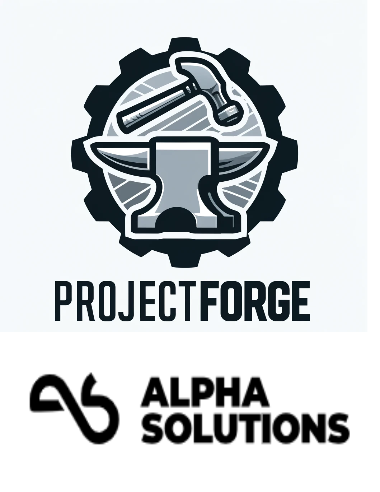

 

**ProjectForge**

**Introduction**

Welcome to ProjectForge, a project creation tool designed to help you manage your projects efficiently. This guide will help you set up and run the program, as well as provide an overview of its features.

**Prerequisites**

To run ProjectForge, you need to have the following installed on your system:
* Java Development Kit (JDK)
* MySQL Workbench
* Java
* MySQL
* Azure
* Thymeleaf
* SpringBoot
* Spring Security
* HTML
* CSS

**Installation Instructions and Setup**

1. Install Java 8 or higher version from the official website.
2. Install MySQL Workbench from the official website.
3. Clone the project from the repository.
4. Open the project in your favorite IDE.

**Database Setup**

1. Open MySQL Workbench.
2. Execute the `database.sql` script provided with ProjectForge to set up the necessary database structure.

**User Creation**

1. After setting up the database, create a user for ProjectForge. This is necessary for password encryption to function correctly.

**Running the Program**

1. Ensure that your MySQL server is running before starting the program.
2. Run the project from your IDE.
3. Open a web browser and navigate to `http://localhost:8080`. You will see the login page.
4. Click on the register button to create a new user.
5. Enter the username and password, then click on the login button. You will see the dashboard page.
6. Click on the 'Add Project' button to add a new project.

**Features**

ProjectForge offers the following features to help you manage your projects effectively:

**Project Management**

•        Add Projects: Create new projects and assign them to your user ID.

•        Delete Projects: Remove projects that are no longer needed.

•        View Projects:

•        Gantt Model: View your projects in a Gantt chart for an overview of timelines and dependencies.

•        Detailed View: Get detailed information about each project.

**User Management**

•        Edit User: Update your user information from the top right corner of the application.

•        Delete User: Remove your user account if needed.

**Session Management**

•        HTTP Sessions: Sessions are enabled, meaning you will be logged out if inactive for a certain period. You will need to log back in to continue using the application.

**Additional Information**

•Projects are assigned to the user ID you created during the setup.

•        Ensure to save your work frequently and log out properly to avoid losing any data due to session timeout.

Thank you for using ProjectForge! If you have any questions or encounter issues, please refer to the troubleshooting section or contact support.

**Troubleshooting**

•        Database Connection Issues: Ensure your MySQL server is running and the connection details in the configuration file are correct.

•        User Creation Issues: Verify that you have the necessary permissions to create users in MySQL.

•        Session Timeouts: If you are frequently logged out, consider adjusting the session timeout settings in the application configuration.

**Support**

For further assistance, please contact asgervb@gmail.com
